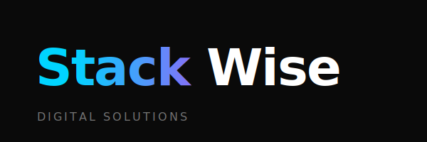

<div align="center">
  
  <br />
  <p><strong>Next-Gen Digital Infrastructure Engineering</strong></p>
  <p>
    <a href="https://stackwise.agency">Live Demo</a> • 
    <a href="#getting-started">Getting Started</a> • 
    <a href="#features">Features</a>
  </p>
</div>

<br />

## ⚡ Overview

**Stackwise** is a high-performance, futuristic digital agency website built to showcase premium engineering capabilities. It features a cinematic, immersive user experience with deep dark aesthetics, neon green accents, and fluid motion design.

This project is engineered with **Next.js 14** and **Tailwind CSS**, prioritizing speed, accessibility, and visual impact.

## 🛠️ Tech Stack

- **Framework:** [Next.js 14](https://nextjs.org/) (App Router)
- **Language:** [TypeScript](https://www.typescriptlang.org/)
- **Styling:** [Tailwind CSS](https://tailwindcss.com/)
- **Animation:** [Framer Motion](https://www.framer.com/motion/)
- **Icons:** [Lucide React](https://lucide.dev/)
- **Fonts:** Custom Editorial Typography (`Oughter`)

## ✨ Key Features

- **Cinematic Hero Section:** Zero-load visual impact with custom 3D-style assets.
- **Glassmorphism UI:** Frosted glass effects for docks, forms, and cards (`backdrop-blur`).
- **Interactive Elements:**
  - **Liquid Metal Buttons:** Physics-based button hover effects.
  - **Magnetic Navigation:** Floating glass dock that auto-hides near footer.
  - **Scroll Animations:** Smooth reveal effects using Intersection Observers.
- **Performance First:**
  - Lazy loading for heavy assets.
  - Optimized font loading.
  - Minimal layout shifts (CLS optimized).
- **Fully Responsive:** Cinematic experience across Desktop, Tablet, and Mobile.

## 🚀 Getting Started

### Prerequisites
- Node.js 18+ 
- npm or yarn

### Installation

1. **Clone the repository**
   ```bash
   git clone https://github.com/trynayash/Stackwise.git
   cd stackwise-web
   ```

2. **Install dependencies**
   ```bash
   npm install
   # or
   yarn install
   ```

3. **Run the development server**
   ```bash
   npm run dev
   ```

   Open [http://localhost:3000](http://localhost:3000) with your browser to see the result.

## 📂 Project Structure

```
stackwise-web/
├── public/              # Static assets (images, fonts, vectors)
├── src/
│   ├── app/             # Next.js App Router pages
│   ├── components/      # React components
│   │   ├── layout/      # Navbar, Footer, Shell
│   │   ├── sections/    # Landing page sections (Hero, About, etc.)
│   │   └── ui/          # Reusable UI primitives (Buttons, Inputs)
│   ├── lib/             # Utilities and data constants
│   └── styles/          # Global styles
└── tailwind.config.ts   # Design system configuration
```

## 📄 License

This project is licensed under the MIT License - see the [LICENSE](LICENSE) file for details.

---

<div align="center">
  <sub>Built with 💚 in India by Trynayash</sub>
</div>
